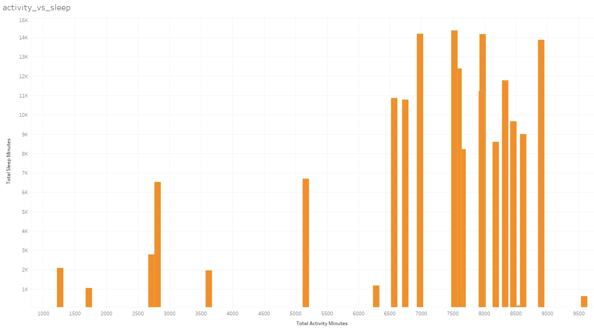

# Business Context
Bellabeat is a high-tech company that manufactures health-focused smart products including Bellabeat app, Leaf, Time and Spring. It also offers a subscription-based membership program for users giving them access to personalised guidance on having a healthy lifestyle. Bellabeat has positioned itself as a tech-driven wellness company for women.

# Problem Statement

As a junior data analyst working on the marketing analyst team at Bellabeat, a high-tech manufacturer of health-focused products for women. Bellabeat is a successful small company, but they have the potential to become a larger player in the global smart device market. Urška Sršen, cofounder and Chief Creative Officer of Bellabeat, believes that analyzing smart device fitness data could help unlock new growth opportunities for the company. Requirement is to focus on one of Bellabeat’s products and analyze smart device data to gain insight into how consumers are using their smart devices. The insights I discover will then help guide marketing strategy for the company. I will present your analysis to the Bellabeat executive team along with your high-level recommendations for Bellabeat’s marketing strategy.

# Data source

- The data used in this analysis is the Fitbit Fitness Tracker Data made available by Mobius stored on Kaggle.
- This dataset is under CC0: Public Domain license meaning the creator has waive his right to the work under the copyright law.
- The dataset has in total 18 files in .csv format organized in long format.


# Data Exploration

The following csv files has been selected for analysis because on exploring the data it is evident that the daily activity ,sleep data and weight log info covers all the data point needed for the analysis. 

- `dailyActivity_merged.csv`
- `sleepDay_merged.csv`
- `weightLogInfo_merged.csv`

## Data Cleaning
- The `sleepDay_merged` file has date information with time as 12:00 AM. Also the column name `SleepDay` is used for Date. So, we can remove the time as it does not add value and also rename the column to just `Date`.

## Data Integrity checks
- Ran the query to check the data integrity for the `daily-activity', 'sleepDay_merged.csv' and 'weightLogInfo_merged.csv'. The result is as below: 
- The Count of unique ids in `daily_activity` table was found to be `33` after executing the below query 
    ```
    select sum(count) total
    from 
    (
    SELECT count(distinct Id) count
    from `bellabeat`.`daily_activity` 
    group by ID
    ) total;
    ```

- The Count of unique ids in `sleepDay_merged` table was found to be `24` after executing the below query 
    ```
    select sum(count) total
    from 
    (
    SELECT count(distinct Id) count
    from `bellabeat`.`sleep_day` 
    group by ID
    ) total;
    ```
- The Count of unique ids in `weightLogInfo_merged` table was found to be `8` after executing the below query 
    ```
    select sum(count) total
    from 
    (
    SELECT count(distinct Id) count
    from `bellabeat`.`weight_loginfo` 
    group by ID
    ) total;
    ````

## Analysis
- We have the activity data, sleep and weight data for the users. We can run a query to check the correlation between
    - Activity duration vs BMI
    - Acitivity duration vs Quality of Sleep
    - BMI vs Sleep


### 1.  Activity duration vs Sleep data

We have to do a left inner join to find the activity and sleep data tables.

    ```
        select da.id, da.total_activity_minutes, sl.total_sleep_minutes
        from 
        (
        select id, SUM(TotalMinutesAsleep) as total_sleep_minutes
        from bellabeat.sleep_day 
        group by id
        ) sl
        left join
        (
        SELECT id, SUM(VeryActiveMinutes + FairlyActiveMinutes + LightlyActiveMinutes) as total_activity_minutes
        FROM bellabeat.daily_activity  
        group by id
        ) da on da.id=sl.id;

    ```

Below is a visualisation to show that people with higher activity probably sleep better.

